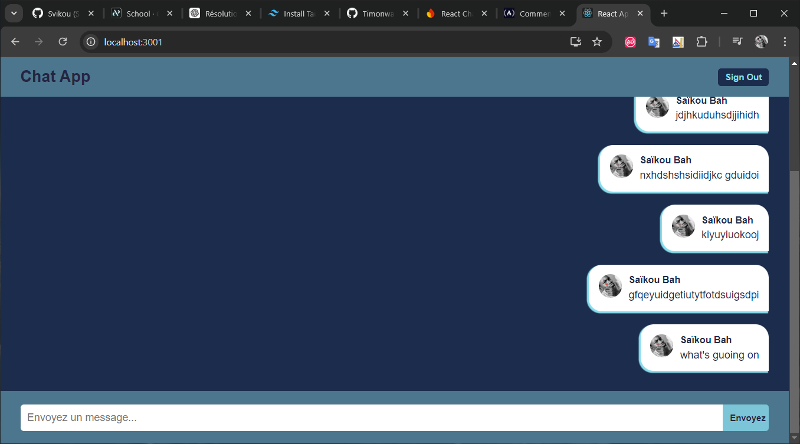

## Chat app in React

**Description :** is an modern web application built with React that allows users to communicate in real-time through a seamless chat interface. It integrates Firebase for user authentication and message storage, ensuring secure and instant interactions. The app provides a clean, user-friendly interface for signing in (via email or Google), sending messages, and viewing conversations in real-time. It supports responsive design, making it accessible across various devices, and allows users to persist their chat history using Firebase Realtime Database.

## Key Features:

• Real time messaging 

• User authentification

## Screenshot 📸

## Technologies Used:

• React

• Firebase
